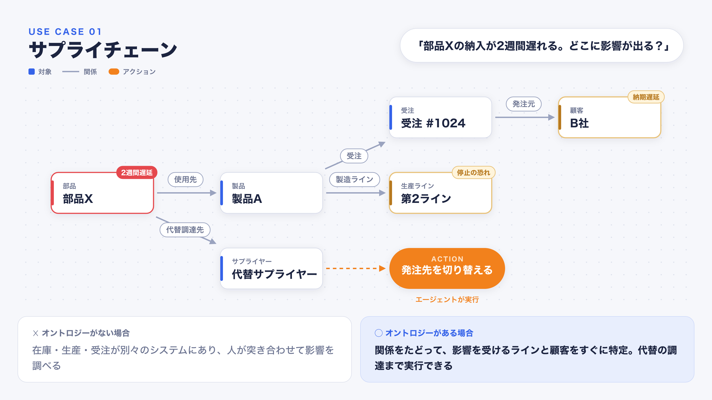
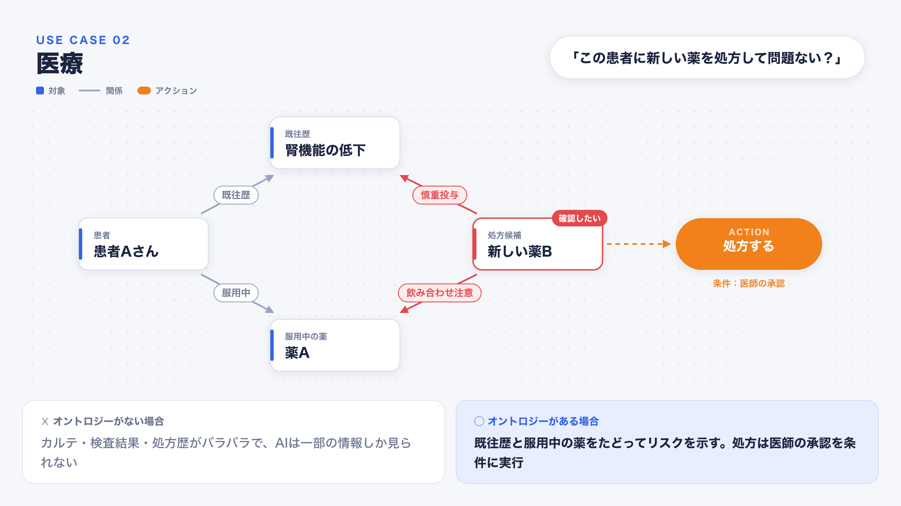
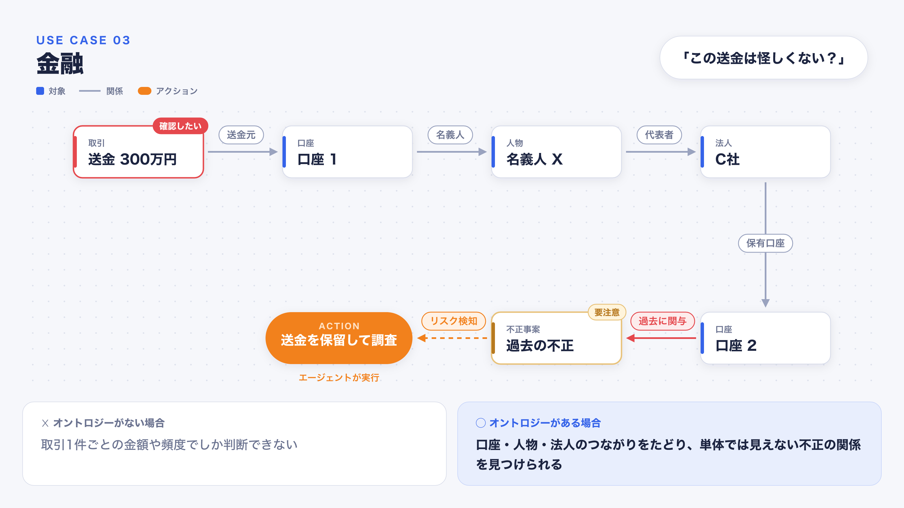
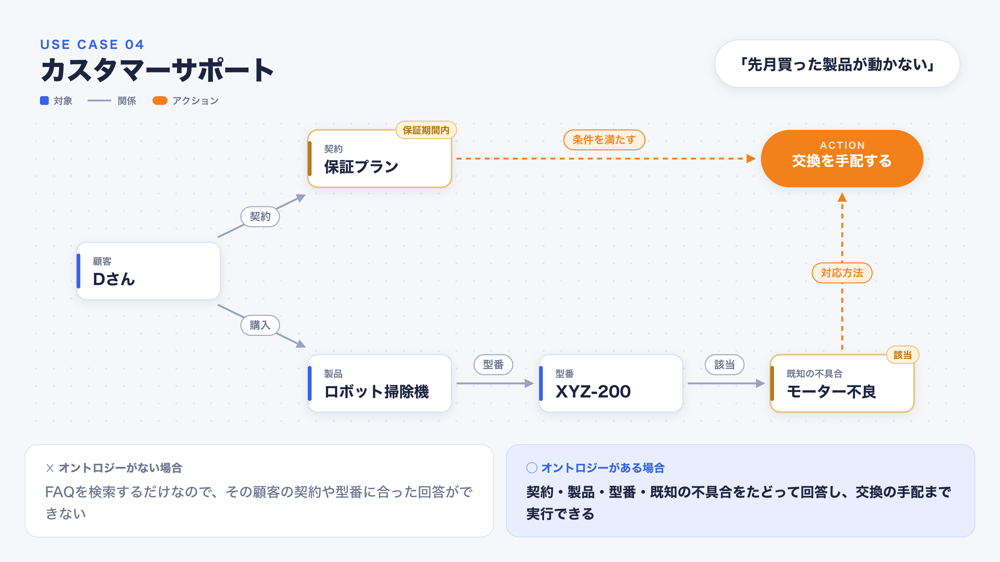

# オントロジー入門 — AIエージェント時代のデータ構造化

## 1. はじめに

こんにちは。PantaRhei でエンジニアをしている、りつきです。
普段は oarthチーム で、データ基盤の開発・運用を担当しています。

oarth では、法人情報をグラフデータベースとして構築しています。企業、事業所、業種、所在地、企業間関係といった情報を「点（ノード）」と「線（リレーション）」でつなぐ中で、「そもそも、どんな概念を、どんな関係で表現すべきなのか？」という問いに何度も向き合うことになりました。

そのときに出会ったのが **オントロジー（Ontology）** という考え方です。

オントロジー自体は古くからある概念ですが、近年パランティア（Palantir）が「AIを業務で動かすための基盤」として打ち出したことで、改めて注目を集めています。

この記事では、オントロジーとは何か、なぜ今AIの文脈で重要なのかを、具体的なユースケースを交えて紹介します。

## 2. オントロジーとは何か

### 従来：哲学の「存在論」

オントロジーの起源は哲学の **「存在論」** で、アリストテレスまでさかのぼります。「世の中には何が存在し、それらはどう分類され、どう関係しているのか」を問う学問です。

その後、情報科学の分野でも、ある領域の概念とその関係を体系的に定義する手法として使われてきました。

### 最新のAI界隈：パランティアの「Ontology」

この考え方を業務の世界に持ち込み、広めたのがパランティアです。パランティアは、データ分析基盤の Foundry や AIプラットフォームの AIP で、**業務データとAIをつなぐ「Ontology」を製品の中心に据えています。**

パランティアのオントロジーは、現実の業務を次の3つの要素でデータとして表現します。

| 要素 | 意味 | 例 |
|---|---|---|
| **対象（Object）** | 業務に登場する「もの」 | 顧客、製品、契約、口座 |
| **関係（Link）** | 対象同士のつながり | 顧客が製品を「購入した」 |
| **アクション（Action）** | 対象に対して実行できる操作 | 交換を手配する、発注先を変える |

従来のオントロジーが「世界をどう分類するか」という**読み取るための体系**だったのに対し、パランティアのオントロジーは「その世界に対して何ができるか」という**アクションまで含めている**のが大きな特徴です。

## 3. なぜ今オントロジーなのか

### 3-1. LLMは言葉を扱えても、自社データの意味は知らない

LLMは一般的な知識には強い一方で、自社のデータが何を意味しているかは知りません。

たとえば「A社の住所は？」と聞かれたとき、答えは一つとは限りません。

- 登記上の本店所在地なのか
- 実際に本社機能がある場所なのか
- 全国にある店舗や事業所なのか

AIが「法人」と「事業所」「店舗」の違いを知らなければ、どれか一つを推測で答えるしかありません。

オントロジーで「法人」「事業所」「店舗」を別々の対象として定義し、「店舗は法人に属する」といった関係を決めておけば、AIは質問に合った単位で答えられるようになります。

### 3-2. RAGだけでは、関係をたどる質問に答えられない

社内の文書をAIに参照させる手法として、RAG（Retrieval-Augmented Generation）が広く使われています。ただし、RAGは基本的に「質問と意味が近い文章」を探す仕組みです。

そのため、「A社の親会社の、別の子会社と取引している顧客は？」のように、**複数の関係をたどらないと答えられない質問**は苦手です。

オントロジーで対象と関係を定義し、グラフとして持っておけば、AIは関係を一つずつたどって答えを導けます。

### 3-3. AIエージェントには「何に対して、何ができるか」の定義が必要

AIは今、質問に答える「チャット」から、実際に業務を実行する「エージェント」へと進化しています。

チャットであれば、間違えても間違った文章が出てくるだけで済みます。一方、エージェントはメール送信やシステムの更新など、実際に操作を行います。間違えると現実に影響が出ます。

たとえば「この顧客に対応しておいて」と指示したとき、定義がなければエージェントは次のことを推測で決めることになります。

- 「対応」とは何を指すのか
- 誰に、どの手段で行うのか
- 実行してよい条件は何か
- 実行した後、何を記録するのか

オントロジーで **対象・関係・アクション** を定義しておけば、エージェントは推測ではなくルールに従って行動できます。

### 3-4. 構造化されたデータを持っていること自体が、会社の強みになる

LLMの性能はどの会社でも同じように使えるようになりつつあります。そうなると差がつくのは、**AIに渡すデータの質**です。

バラバラのデータをそのままAIに渡しても、精度は上がりません。意味と関係が整理されたデータを持っていること自体が、これからの競争力になります。

## 4. ユースケース

ここからは、オントロジーが実際にどう役立つのかを、業界別の4つのユースケースで紹介します。

各図の見方は次の通りです。

- **白いカード**：対象（赤い枠は起点、黄色いタグは影響やリスクがあるもの）
- **矢印**：関係（赤い矢印はリスクのある関係）
- **オレンジ**：アクション

### 4-1. サプライチェーン：部品の遅延の影響を把握する

「部品Xの納入が2週間遅れる」という連絡が入ったとします。

オントロジーがない場合、在庫・生産計画・受注はそれぞれ別のシステムで管理されているため、担当者が突き合わせて影響を調べるしかありません。

オントロジーがある場合は、**部品 → 製品 → 生産ライン・受注 → 顧客** と関係をたどることで、停止の恐れがあるラインと、納期が遅れる顧客をすぐに特定できます。さらに、部品に紐づく代替サプライヤーを見つけ、エージェントが発注先の切り替えまで実行できます。

### 4-2. 医療：患者の情報を横断して判断を支援する

「この患者に新しい薬を処方して問題ないか」を確認したい場面です。

オントロジーがない場合、カルテ・検査結果・処方歴がバラバラに管理されており、AIは一部の情報しか見ることができません。

オントロジーがある場合は、**患者 → 既往歴・服用中の薬** と、**新しい薬 → 慎重投与が必要な疾患・飲み合わせに注意が必要な薬** の関係を重ね合わせることで、リスクを示せます。

また、「処方する」というアクションに「医師の承認」を実行条件として定義しておけば、AIが勝手に処方を進めることはありません。**人間の判断が必要な場面を、ルールとして組み込める**のもオントロジーの強みです。

### 4-3. 金融：不正取引を検知する

「この送金は怪しくないか」を判断する場面です。

オントロジーがない場合、判断材料は取引1件ごとの金額や頻度に限られます。

オントロジーがある場合は、**送金 → 送金元の口座 → 名義人 → 代表を務める法人 → その法人の別の口座 → 過去の不正事案** と、つながりをたどれます。取引単体では問題がなさそうに見えても、関係をたどると不正に関わった口座とつながっている、というケースを見つけられます。

リスクを検知したら、エージェントが送金を保留し、調査に回すところまで実行できます。

### 4-4. カスタマーサポート：問い合わせに正確に回答する

「先月買った製品が動かない」という問い合わせが来た場面です。

オントロジーがない場合、AIはFAQを検索して一般的な回答を返すことしかできず、その顧客の契約や製品の型番に合った回答はできません。

オントロジーがある場合は、**顧客 → 購入した製品 → 型番 → 既知の不具合** をたどって原因を特定し、**顧客 → 契約** から保証期間内であることを確認できます。この2つの条件がそろえば、エージェントが交換の手配まで実行できます。

## 5. まとめ

- オントロジーは、業務に登場する **対象・関係・アクション** を定義し、データに意味を与えるもの
- 起源は哲学の存在論だが、パランティアによって「AIを業務で動かすための基盤」として改めて注目されている
- LLMの弱点である「自社データの意味を知らない」「関係をたどれない」「行動のルールがない」を補う

AIエージェントが業務を担うようになるほど、差がつくのはモデルの性能ではなく、**AIに渡すデータが意味を持って構造化されているかどうか** になっていきます。オントロジーは、人間とAIが同じ言葉で業務を理解するための共通言語です。

oarth でも、この考え方を法人データに取り入れていきます。
